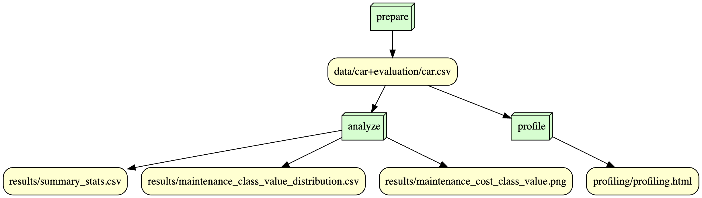

# IS477: Final Project

## Overview

### 
The purpose of this project is to create an end-to-end analysis based on techniques that the author, Edward Zhang, has learned over the entirety of the course - IS477. 

The dataset that was utilized for this project is the Car Evaluation dataset from the UCI Machine Learning Repository. Within this datatset, there are 6 categorical features - buying price, price of maintenance, number of doors, capacity in terms of people to carry, the size of luggage, estimated safety - that are aimed towards predicting the target variable of the evaluation level of the car. 

Delving deeper into the additional purpose of this project, I wanted to analyze car evaluations by determining the relationship between maintenance value and the class value of the car.

My analysis resulted in a visualization that can be found in the results folder as "maintenance_cost_class_value_chart.png" where a distribution of varying car evaluations by class values are plotted against their repsective maintenance costs. At a high-level overview, this graph suggests that lower maintenance costs are more preferred for buyers. However, it's worthwhile nothing that there are still high value evaluations across all maintenance costs. Finally, it appears that a majority of the ratings are "unacceptable" which may be biased by a different variable which may need to be taken a look at.

## Analysis

###
Delving deeper into the analysis, cars that have a low maintenance cost tend to have a relatively higher proportion of "vgood" classifications compared to cars following other maintenance categories. Overall, there is a trend that illustrates how cars with a lower maintenance cost are seen as more acceptable - shown through the positive ratings. This shows how cars with a lower maintenance cost are perceived as more acceptable to buyers.

## Workflow

### 
a.	The data license that I would use is the Creative Commons CCZero which is the most open data license. I selected this choice because I don’t need to copyright my dataset nor profit off of it in any means. By choosing a public domain license, I look forward to more collaboration instead and it does not matter to me who uses the data so long as it’s not for malicious purposes

## Reproducing

###
In order to reproduce this script, here are the following steps:

1. Environment log
    
Look to the environment.log file that contains all of the information that was used/needed in order to reproduce this repository. 

2. Setting up to run the script

    2a. First, clone this repository 

    2b. Then, create a virtual environment which you can do by going into the command line and selecting Python: Create Environment. After that, select .venv and choose the appropriate Python interpreter and you will know that this is successful for when you have a .venv folder. 

    Check if the correct directories and subsequent folders are set up - data, scripts, and results. Within data, check if the correct files are downloaded as indicated by the following step. 

    When downloading the data, make sure that you unzip the file and move all contents to the repsective folder within this repository will be in - indicated by data. After that, rename the car.data file to car.csv to ensure proper analysis can be conducted later. 

    Check and correct the relative paths in the scripts folder to see if the results in the scripts are copied to the right directories and subdirectories. 

    Create a Snakefile and a dag.py to determine whether the workflows are being followed as referenced by the image - graph.png - in the above section.

    2c. Install dependencies in the virtual environment through pip install -r requirements.txt

    2d. Reference environment.log to check if there are any dependencies that you may have missed in case your code does not work. 

3. Run the script
Use the following scripts "prepare_data.py", "reproduce_adult", and "reproduce_reconstruction" and run it. 

4. Check the file uploads
There should be files in the results folder labeled as "maintenance_class_value_distribution.csv", "maintenance_cost_class_value_chart.png", and "summary_stats.csv" with the accuracies labeled. 

## Licenses

### Software License
a.	The license that I choose to use is the MIT license because it allows the widest adoption, fewest restrictions, and allows for open and easy collaboration and transparency amongst everyone who access the source code. Given that none of the software involved will require any additional permission, the MIT license is preferred. 

### Data License
a. The license for this dataset is Creative Commons Attribution 4.0 International which means that it's freely able to be used for any purpose with no restrictions on distribution or modification.

## Citations

###
